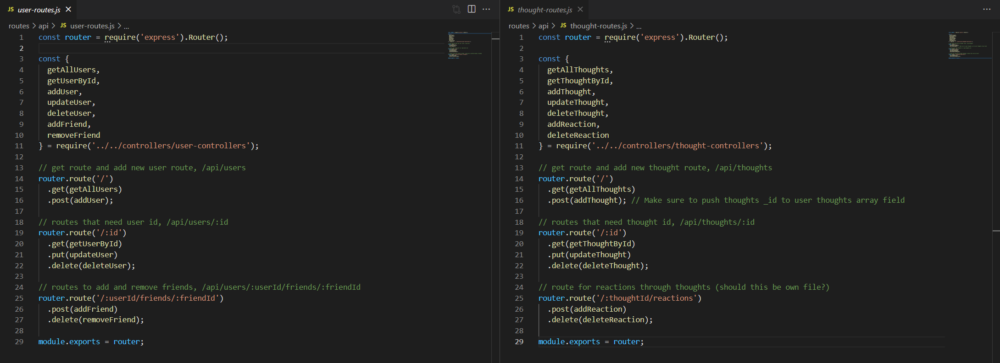
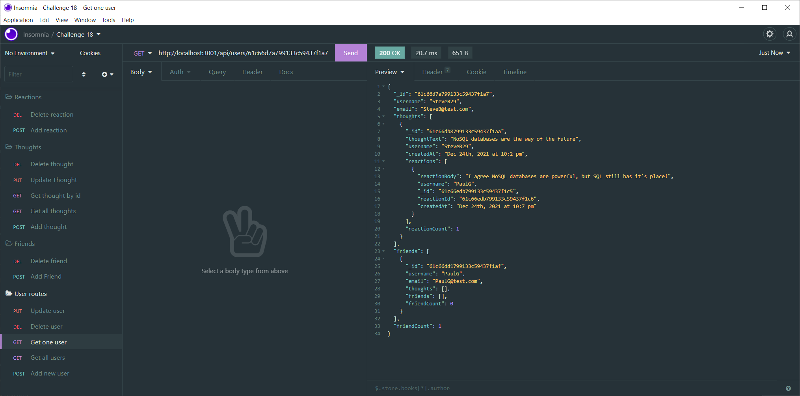

# NoSQL Social Network API
- Database and API built for a social networking platform
- NoSQL database means the application is easily scalable
- Utilizes express for the API and Mongoose for the database and querying
- Includes Get, Post, Put, and Delete routes for Users and Thoughts. Post and Delete routes for Friends and Reactions

## Video Walkthrough and GitHub Repo
- Video Walkthrough coming soon!
- [GitHub Repository](https://github.com/SteveB29/mongo-social-api)

## Screenshots

